# System Design: llm-for-zotero

> Architecture and design documentation for **llm-for-zotero** (v3.8.26), a Zotero 7–9 plugin that embeds an LLM research assistant and agent in the PDF reader and library UI.

| | |
|---|---|
| **Product** | AI research agent rooted in the Zotero library |
| **Upstream** | [yilewang/llm-for-zotero](https://github.com/yilewang/llm-for-zotero) |
| **License** | AGPL-3.0-or-later |
| **Host** | Zotero desktop (Mozilla / XUL plugin process) |
| **Language** | TypeScript (ESM), Firefox 115 target |
| **Ship unit** | `.xpi` add-on (no core backend server) |

---

## Table of Contents

1. [Goals and Scope](#1-goals-and-scope)
2. [System Context](#2-system-context)
3. [High-Level Architecture](#3-high-level-architecture)
4. [Plugin Lifecycle](#4-plugin-lifecycle)
5. [UI Layer](#5-ui-layer)
6. [Conversation Runtimes](#6-conversation-runtimes)
7. [Agent Subsystem](#7-agent-subsystem)
8. [Tools, Actions, and Skills](#8-tools-actions-and-skills)
9. [Model and Provider Layer](#9-model-and-provider-layer)
10. [Data Persistence](#10-data-persistence)
11. [External Integrations](#11-external-integrations)
12. [Request Data Flows](#12-request-data-flows)
13. [Security and Safety Model](#13-security-and-safety-model)
14. [Build, Test, and Deployment](#14-build-test-and-deployment)
15. [Directory Map](#15-directory-map)
16. [Key Source References](#16-key-source-references)

---

## 1. Goals and Scope

### Primary goals

- Chat about the current PDF, selection, figures, screenshots, and uploaded documents **inside Zotero**.
- Produce grounded answers with **clickable citations** back into the PDF.
- Support multi-paper comparison and notes (Zotero notes + Obsidian / Logseq / Markdown folders).
- Provide **Agent Mode**: library-wide read / search / write tools with confirmation and undo.
- Support multiple backends: API keys, local OpenAI-compatible servers, WebChat, Codex App Server, Claude Code.
- Improve PDF fidelity via **MinerU** (cloud or local `mineru-api`).

### Non-goals (architectural)

- Not a microservice or multi-node cloud product.
- No dedicated vector database (retrieval is in-process embedding + scoring).
- Claude Code mode does not yet expose the full native Zotero tool surface.

---

## 2. System Context

The plugin runs **inside the Zotero process**. Optional companions (Codex CLI, Claude bridge, MinerU, Chrome WebChat extension) attach via local HTTP / process bridges.

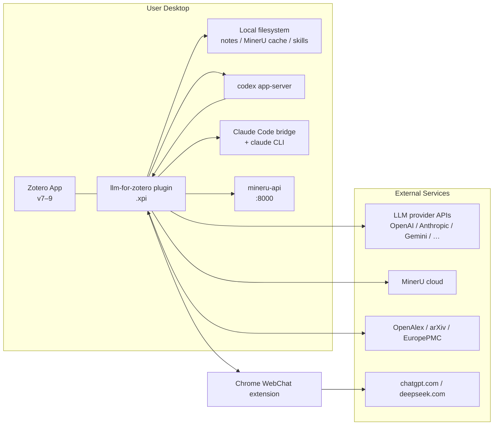

### Actors

| Actor | Interaction |
|-------|-------------|
| Researcher | Reader sidebar, standalone chat window, preferences, shortcuts |
| LLM provider | Streaming completions / Responses / Anthropic Messages / Gemini |
| Zotero library | Items, collections, notes, annotations, attachments via `ZoteroGateway` |
| Companion CLIs | Codex App Server, Claude bridge, local MinerU |
| Chrome extension | Relays WebChat sessions into Zotero HTTP endpoints |

---

## 3. High-Level Architecture

Logical layers inside the plugin process:

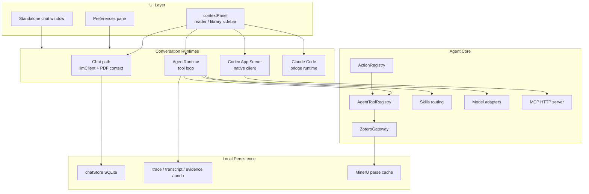

### Design principles

1. **Single-process plugin** — networking is mostly outbound HTTP clients plus Zotero’s built-in local HTTP server for MCP / WebChat.
2. **Dual engines** — classic chat (`llmClient` + context builders) vs agent loop (`AgentRuntime` + tools), plus parallel Codex / Claude conversation systems.
3. **Gateway boundary** — agent writes go through tools → `ZoteroGateway`, not ad-hoc UI → Zotero API calls.
4. **Cache-aware agenting** — evidence / coverage ledgers, transcript compaction, and tool-result handles keep long research sessions within model context limits.
5. **Human-in-the-loop writes** — mutating tools emit confirmation cards; undo covers recent session writes.

---

## 4. Plugin Lifecycle

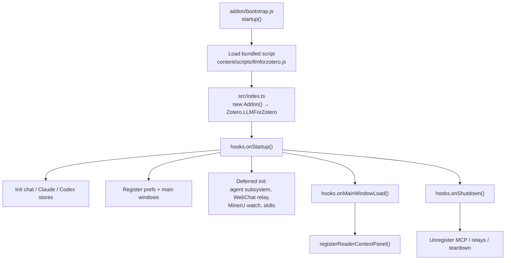

| Stage | Key files |
|-------|-----------|
| Bootstrap | `addon/bootstrap.js`, `addon/manifest.json` |
| JS entry | `src/index.ts` → `Addon` in `src/addon.ts` |
| Lifecycle | `src/hooks.ts` |
| Agent init | `src/agent/index.ts` → `initAgentSubsystem()` |
| Build entry | `zotero-plugin.config.ts` bundles `src/index.ts` |

---

## 5. UI Layer

The primary surface is the **reader context panel** (`src/modules/contextPanel/`).

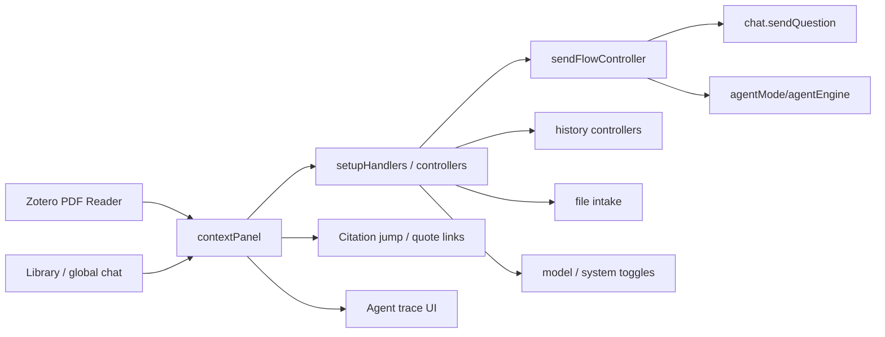

### Surfaces

| Surface | Role |
|---------|------|
| Reader sidebar | Paper Q&A, selection, screenshots, Agent Mode for current item |
| Library / global chat | Cross-library questions and organization |
| Standalone window | `standaloneChat.xhtml` — dedicated assistant (shortcut Ctrl/Cmd+Shift+L) |
| Preferences | Provider credentials, Agent / Codex / Claude / MinerU / notes paths |
| Confirmation cards | HITL review tables, checklists, paper import lists |

Mode resolution lives in `src/modules/contextPanel/modeBehavior.ts` (`resolveRuntimeModeForConversation`).

---

## 6. Conversation Runtimes

Three **conversation systems** coexist (pref: `conversationSystem`):

| System | Pref / flag | Storage | Execution |
|--------|-------------|---------|-----------|
| **Upstream** (default) | `upstream` | `chatStore` | Chat via `llmClient` **or** Agent via `AgentRuntime` |
| **Codex** | `codex` | `codexAppServer/store` | Local `codex app-server` + MCP Zotero tools |
| **Claude Code** | `claude_code` | `claudeCode/store` | Bridge `http://127.0.0.1:19787` → `claude` CLI |

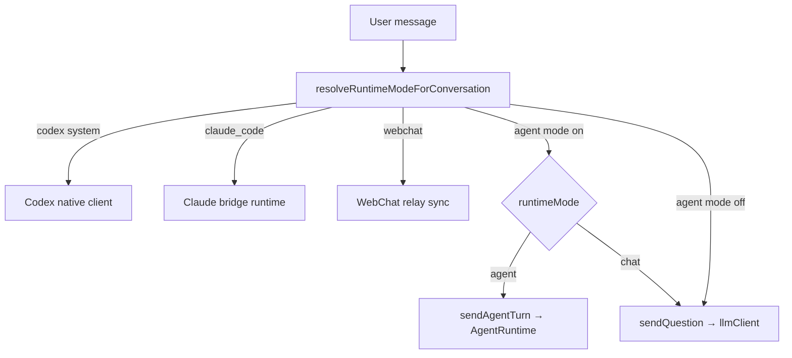

Default scope heuristics (when Agent Mode is enabled): library / global / note chat often prefer **agent**; single-paper chat often prefers **chat**.

---

## 7. Agent Subsystem

Initialized by `initAgentSubsystem()` in `src/agent/index.ts`.

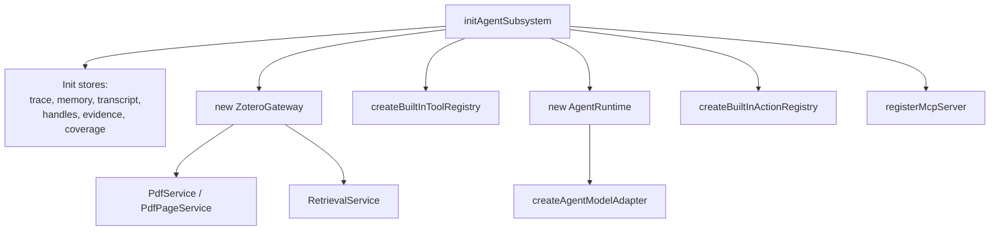

### `AgentRuntime.runTurn` (conceptual)

1. Create run / emit status events.
2. Hydrate evidence cache, coverage ledger, transcript.
3. Match skills (slash, forced IDs, classifier, regex).
4. Build messages (`messageBuilder`) and enforce prompt budget; compact if needed.
5. Loop: model adapter `runStep` → optional confirmation → tool `prepareExecution` / `execute`.
6. Commit transcript / evidence / artifacts; emit `final`, usage, traces.

Public extension surface: `addon.api.agent` (`getAgentApi`) — `runTurn`, `registerTool`, `runAction`, confirmation resolution helpers.

---

## 8. Tools, Actions, and Skills

### 8.1 Model-visible façade tools

Registered in `src/agent/tools/index.ts` via `createBuiltInToolRegistry`.

| Tool | Mutability | Purpose |
|------|------------|---------|
| `library_search` | read | Discover items, collections, tags, duplicates |
| `library_read` | read | Metadata, notes, annotations, attachments |
| `library_retrieve` | read | Cross-library evidence retrieve |
| `paper_read` | read | Modes: `overview` / `targeted` / `figures` / `visual` / `capture` |
| `literature_search` | read | OpenAlex / arXiv / EuropePMC workflows |
| `library_update` | write + confirm | Tags, collections, metadata |
| `collection_update` | write + confirm | Create / delete collections |
| `note_write` | write + confirm | Create / append / edit notes |
| `library_import` | write + confirm | Identifiers or local files |
| `library_delete` | write + confirm | Trash or merge |
| `attachment_update` | write + confirm | Delete / rename / relink |
| `undo_last_action` | write | Session undo |
| `file_io` | advanced write | FS ops in allowed roots |
| `run_command` | advanced write | Analysis shell commands |
| `zotero_script` | advanced write | Execute Zotero JS |
| `tool_result_read` | read | Re-read compacted tool-result handles |

Legacy internals (`query_library`, `read_paper`, `apply_tags`, …) remain with `exposure: "internal"` and are reached through façades (`createDelegatingTool` / `createRenamedTool`).

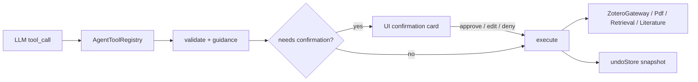

### 8.2 Built-in actions (workflows)

`createBuiltInActionRegistry()` — invoked via `addon.api.agent.runAction` or slash-style UI:

| Action | Name |
|--------|------|
| Library audit | `audit_library` |
| Organize unfiled | `organize_unfiled` |
| Auto-tag | `auto_tag` |
| Discover related | `discover_related` |
| Complete metadata | `complete_metadata` |
| Sync metadata | `sync_metadata` |
| Literature review | `literature_review` |
| Library statistics | `library_statistics` |

### 8.3 Skills

Bundled Markdown skills under `src/agent/skills/*.md` (plus user skills on disk under `{ZoteroDataDir}/llm-for-zotero/skills/`):

- `simple-paper-qa`
- `evidence-based-qa`
- `analyze-figures`
- `compare-papers`
- `library-analysis`
- `literature-review`
- `write-note`
- `import-cited-reference`

Activated by slash commands, `forcedSkillIds`, classifier, or frontmatter match patterns (`skillLoader` / `routing`).

### 8.4 MCP exposure (Codex)

`src/agent/mcp/server.ts` publishes curated tools on Zotero’s local HTTP server (typically port **23119**), path roughly:

`http://localhost:<port>/llm-for-zotero/mcp`

Bearer token + scope headers; Codex App Server consumes these tools rather than running the TypeScript `AgentRuntime` tool loop.

---

## 9. Model and Provider Layer

### Protocols

Resolved via `providerProtocol` / `authMode` (`src/utils/providerProtocol.ts`):

| Protocol | Adapter |
|----------|---------|
| `responses_api` | `OpenAIResponsesAgentAdapter` (or chat-compat fallback) |
| `openai_chat_compat` | `OpenAIChatCompatAgentAdapter` |
| `anthropic_messages` | `AnthropicMessagesAgentAdapter` |
| `gemini_native` | `GeminiNativeAgentAdapter` |
| `codex_responses` | `CodexResponsesAgentAdapter` |
| `codex_app_server` | Native path stub (runtime bypass) |
| `web_sync` | WebChat relay (chat path) |

Factory: `src/agent/model/factory.ts` → `createAgentModelAdapter`.

### Chat path client

`src/utils/llmClient.ts` handles streaming chat completions, embeddings (`callEmbeddings` for semantic passage retrieval), usage accounting, and provider quirks for the classic chat engine.

### Provider capability tiers

`src/providers/registry.ts` classifies providers (native / copilot / codex / …) so UI and runtimes can gate features (files, reasoning, tools).

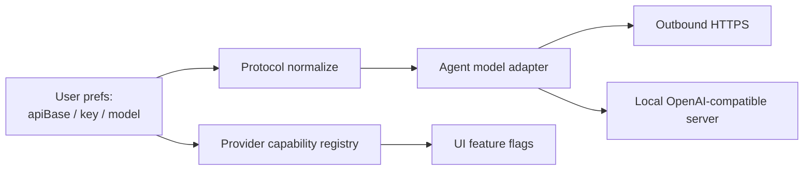

---

## 10. Data Persistence

Everything is **local to the Zotero data directory / Zotero.DB** (unless the user sends prompts to a cloud LLM).

### Chat / conversation

| Store | Responsibility |
|-------|----------------|
| `src/utils/chatStore.ts` | `llm_for_zotero_chat_messages`, global / paper conversation tables |
| `src/shared/conversationRegistry.ts` | Canonical conversation IDs + system / scope |
| Schema migrations | `conversationSchemaMigrations` |

`StoredChatMessage` includes role, text, timestamps, `runMode`, contexts, quote citations, attachments, reasoning, WebChat metadata, token usage.

### Agent stores

| Store | Role |
|-------|------|
| `traceStore` | Per-run tool / step traces for UI |
| `transcriptStore` | Compactable agent transcript |
| `toolResultHandles` | Pointers to large tool outputs |
| Evidence / coverage | Prior reads + what has been covered |
| `undoStore` | ~last 10 write actions per session |
| Conversation memory | Cross-turn memory helpers |

### On-disk caches

- MinerU parse / figure crop caches
- Embedding cache for semantic retrieval (`embeddingCache`)
- Skills directories and notes directories (Obsidian / Logseq / Markdown)

There is **no Pinecone / Chroma / external vector DB**.

---

## 11. External Integrations

| Integration | Mechanism | Key modules |
|-------------|-----------|-------------|
| Zotero APIs | In-process | `ZoteroGateway`, contextPanel |
| LLM clouds | HTTPS | `llmClient`, model adapters, `providerPresets` |
| Local LLMs | OpenAI-compatible HTTP | same clients, custom `apiBase` |
| Literature | OpenAlex, arXiv, EuropePMC | `literatureSearchService` |
| MinerU | Cloud or `http://127.0.0.1:8000` | `mineruClient`, `modules/mineru*` |
| WebChat | Chrome extension ↔ Zotero HTTP | `webchat/relayServer.ts` |
| Codex | Local `codex` binary + MCP | `codexAppServer/*` |
| Claude Code | Bridge `:19787` | `claudeCode/*` |
| Notes dirs | Local vault paths | `notesDirectoryConfig`, `note_write` |

---

## 12. Request Data Flows

### 12.1 Chat mode (paper Q&A)

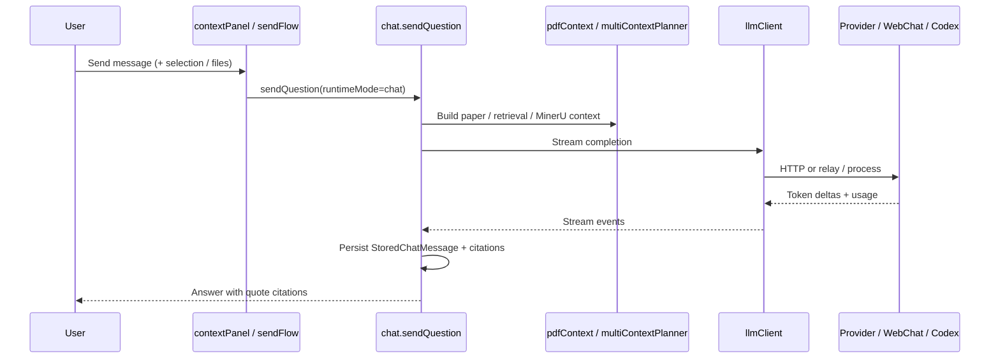

### 12.2 Agent mode (tools)

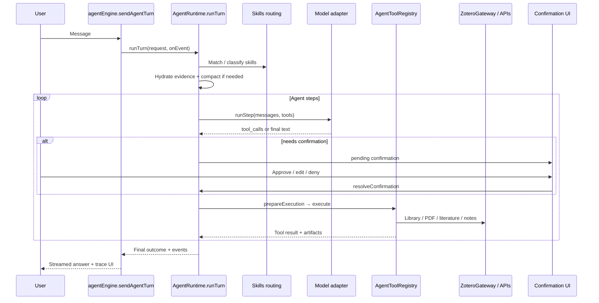

### 12.3 Privacy summary

- Library content and prompts leave the machine **only** when sent to the configured provider (or WebChat tab / Claude / Codex pipelines).
- Conversation history and agent caches remain in local SQLite / filesystem.
- MCP and WebChat endpoints bind on Zotero’s local HTTP server and should not be exposed to the public internet.

---

## 13. Security and Safety Model

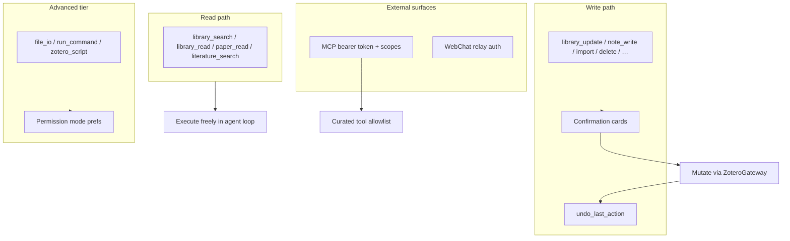

| Control | Behavior |
|---------|----------|
| Confirmation | Writes surface rich HITL cards before applying |
| Undo | Session-scoped rollback of recent writes |
| Tool tiers | Advanced tools gated by permission preferences |
| MCP | Tokenized; subset of tools; intended for local Codex |
| Claude Code | Separate system; limited native Zotero API ops today |

---

## 14. Build, Test, and Deployment

### Tech stack

| Layer | Choice |
|-------|--------|
| Language | TypeScript ESM |
| Toolkit | `zotero-plugin-toolkit` |
| Build | `zotero-plugin-scaffold` + esbuild |
| UI deps | `marked`, `highlight.js`, `katex`, `mermaid`, `fflate` |
| Tests | Mocha + tsx (`test/`), workflow tests (`test-workflows/`) |

### Commands

```bash
npm start          # zotero-plugin serve (dev, live reload)
npm run build      # produce .xpi artifacts under .scaffold/build
npm test           # typecheck + unit + workflow
npm run release    # scaffold release pipeline
```

### Release

- CI: `.github/workflows/release.yml` on tag `v*` → `npm ci` → `build` → `release`
- End users install the GitHub Releases `.xpi` via Tools → Add-ons
- Dev: copy `.env.example` → `.env` with local Zotero binary / profile paths

### Optional runtime companions

| Companion | Purpose |
|-----------|---------|
| Local OpenAI-compatible server | Private / offline models |
| MinerU cloud or `mineru-api` | High-fidelity PDF parse |
| ChatGPT Plus + `codex` CLI | Codex App Server mode |
| `cc-llm4zotero-adapter` bridge | Claude Code mode |
| sync-for-zotero Chrome extension | WebChat |

**Not Dockerized** as a service — deployable unit is the XPI plus optional local CLIs.

---

## 15. Directory Map

```
llm-for-zotero-agent/
├── addon/                      # Chrome manifest, bootstrap, prefs, XHTML, CSS, locales
├── src/
│   ├── index.ts                # Entry: Addon singleton
│   ├── addon.ts                # Plugin shell (data, hooks, api)
│   ├── hooks.ts                # Startup / window / shutdown
│   ├── agent/                  # Runtime, tools, actions, skills, MCP, model adapters
│   │   ├── runtime.ts          # AgentRuntime tool loop
│   │   ├── tools/{read,write}/ # Tool implementations + façades
│   │   ├── services/           # ZoteroGateway, PDF, retrieval, literature
│   │   ├── model/              # Protocol adapters + factory
│   │   ├── context/            # Evidence, coverage, prompt budget
│   │   ├── store/              # Traces, transcript, undo, handles
│   │   ├── actions/            # Named workflows
│   │   ├── skills/             # Built-in SKILL.md + routing
│   │   └── mcp/                # Local MCP HTTP server
│   ├── modules/contextPanel/   # Main chat UI + agentEngine
│   ├── providers/              # Capability tiers
│   ├── shared/                 # Cross-cutting types + conversation helpers
│   ├── utils/                  # llmClient, prefs, MinerU, transports
│   ├── webchat/                # ChatGPT / Deepseek web-sync relay
│   ├── codexAppServer/         # Native Codex integration
│   ├── claudeCode/             # Claude Code bridge
│   └── contextCache/           # Prompt-cache telemetry
├── scripts/                    # Cycle check, workflow runner, PDF figure runtime
├── test/                       # Unit tests
├── test-workflows/             # In-Zotero workflow tests
├── assets/                     # README / marketing images
├── doc/                        # Localized READMEs, figure-runtime notes
├── typings/                    # prefs / i10n / globals
├── package.json
├── zotero-plugin.config.ts
└── SYSTEM_DESIGN.md            # This document
```

---

## 16. Key Source References

| Topic | Path |
|-------|------|
| Bootstrap | `addon/bootstrap.js`, `src/index.ts`, `src/hooks.ts` |
| UI overview | `src/modules/contextPanel/README.md` |
| Chat vs agent dispatch | `src/modules/contextPanel/chat.ts`, `agentMode/agentEngine.ts` |
| Mode resolution | `src/modules/contextPanel/modeBehavior.ts` |
| Agent loop | `src/agent/runtime.ts` |
| Tool assembly | `src/agent/tools/index.ts` |
| Public agent API | `src/agent/index.ts`, `src/agent/extensionApi.ts` |
| Zotero façade | `src/agent/services/zoteroGateway.ts` |
| LLM HTTP | `src/utils/llmClient.ts` |
| Model adapters | `src/agent/model/factory.ts` |
| MCP | `src/agent/mcp/server.ts` |
| Prefs defaults | `addon/prefs.js` |
| Product overview | `README.md` |
| Build | `zotero-plugin.config.ts`, `package.json` |

---

## Architectural takeaways

1. **llm-for-zotero is a Zotero plugin first** — architecture is organized around embedding rich LLM UX and tools inside an existing desktop app, not around cloud orchestration.
2. **Two complementary engines** (chat + agent) plus **two alternate conversation systems** (Codex, Claude) share one UI shell and local storage story.
3. **Safety is structural**: façades, confirmation cards, undo, advanced tiers, and MCP scoping — not just prompt instructions.
4. **Context engineering is first-class**: evidence caches, coverage ledgers, compaction, and tool-result handles exist because research sessions are long and PDFs are large.
5. **Largest ownership hotspots** for future refactors: `chat.ts`, `llmClient.ts`, `ZoteroGateway`, `agentEngine.ts`, and `runtime.ts`.

---

*Generated from codebase analysis of the local `llm-for-zotero-agent` tree (plugin version 3.8.26).*
